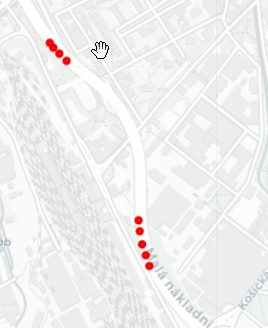
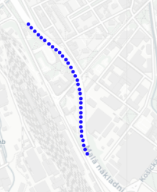
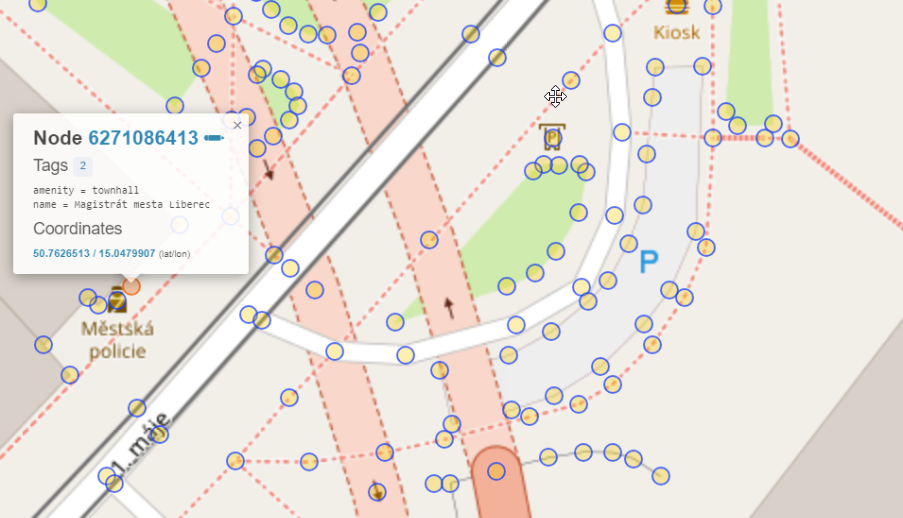
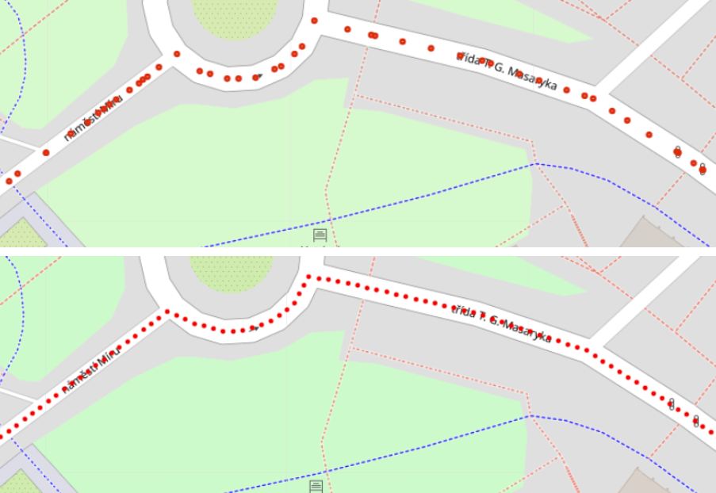

# TUL Routing Library

The TUL Routing library (tul_routing) aims to extract and process data from map data, enabling easy integration into various projects working with geographic data or location-based services.

The library comprises two main parts:
1. Extracting data from map data and potential data modification.
2. Data processing and segmentation.


## Defining the Input File

The library supports a wide range of input file formats, providing flexibility crucial for working with diverse geographic and map data types in applications ranging from navigation to geographic analysis. The supported formats include '.gpx,' '.kml,' '.tcx,' '.geojson,' '.csv,' and '.json.'. We provide [file examples](./file_types.md) if needed. 

## Server Configuration

The library uses three API servers to retrieve data from the map data, with Docker images prepared for deployment using Docker containers. Each server has a specific purpose:
1. The open elevation/open-elevation image specializes in providing an elevation profile.
2. The osrm/osrm-backend image ensures the route corresponds to the road surface.
3. The wiktorn/overpass-api image is dedicated to OpenStreetMap metadata extraction, storing essential traffic information.

A sample server configuration is provided:
```python

from tul_routing import Config
config = Config(
    osrm_api_server="<your_osrm_server>",
    open_elevation_api_server="<your_open_elevation_server>",
    overpass_api_server="<your_overpass_server>",
)
```

To efficiently manage and run the three servers used in the tul-routing library, it is advisable to use Docker Compose.

## Extracting information from Map Data

The process of extracting data from map data begins with performing several transformation steps, as described below. The result of these transformations is a pandas.DataFrame (DF) object containing all the necessary information for further processing. The data frame includes primary columns defining route geometry, elevation profile, or other cues configurable by the user, enriching individual nodes or paths. All these columns are then used for route segmentation.

### 1. Parsing the Input File

The data processing process starts with analyzing and converting input files into DataFrames. A flexible data model is used to unify different file types into a single structure, accommodating essential information such as GPS coordinates, time stamps, and recorded speeds.

### 2. Enriching Map Data

Data normalization is performed before processing GPS coordinates from and querying the servers.

#### Initial Data Filtering

The library filters out points where the vehicle (or other entity) was stationary, providing no additional information. Further filtering removes potentially invalid data points caused by erroneous values recorded when there is little or no GPS signal.

For example, a 0,0 position entry may occur in case of GPS signal failure. This optimization improves the accuracy of acquired data, which is needed to enrich input GPS coordinates with additional information thoroughly.

#### Attaching GPS Coordinates to a Valid Map Base

In the second processing step, specified GPS coordinates are adjusted using the osrm/osrm-backend image to match actual routes in the map base. Correction is necessary for accurate mapping of the vehicle route, assuming the driver remains on the roadway and off-road recording is an error. The example below illustrates how incorrect GPS coordinates are transformed to the nearest point on the path.

Attaching GPS coordinates to the map data may sometimes be inaccurate, especially when the GPS signal is weak or inaccurate. For example if the vehicle entering a tunnel. 





#### Getting OpenStreetMap Metadata for an Input Route

The Overpass API server provides information about traffic infrastructure, such as intersections, speed limits, and other road information. Emphasis was placed on optimizing queries to create an enriched data frame quickly.

#### Custom Data Enrichment by the user

Users can define custom data enrichment functions at the level of map nodes or roads. These functions accept a single parameter, a dictionary containing metadata for a given node or route, and must return a dictionary with all new columns for the resulting DataFrame.

The example below demonstrates how a user can define a custom data enrichment function to extract additional columns, such as the maximum speed for a given route or road point.

```python
from tul_routing import TulRouting, Config, SegmentationKind, EnrichOptions
# 0) define the path to the file
path_to_the_file = "file_name.kml"


def way_enrichment(way_tags) -> dict:
    return {
        'way_source': way_tags.get('source', "<unknown>"),
        'maxspeed': float(way_tags.get('maxspeed', -1)),
        'surface': way_tags.get('surface', "<unknown>"),
     }

def node_enrichment(node_tags) -> dict:
    return {
        'node_source': node_tags.get('source', "<unknown>"),
        'maxspeed': float(node_tags.get('maxspeed', -1)),
     }
    
config = Config(
    osrm_api_server="<your_osrm_server>",
    open_elevation_api_server="<your_open_elevation_server>",
    overpass_api_server="<your_overpass_server>",

    enrich_options=EnrichOptions(
        way_enrichment=way_enrichment,
        node_enrichment=node_enrichment,
    )
)
```

In the image bellow you can see the metadata provided by OverPass API. 



The metadata provided by the Overpass server is shown, and custom columns are incorporated into the resulting DF, used for route segmentation.


#### Getting the Input Route Elevation

The Open Elevation API allows determining the elevation profile of a route, aiding in understanding the potential effects of terrain on vehicle speed and dynamics.

## Fixed Distance Data Segmentation

Waypoints provided by OpenStreetMap are not evenly distributed along the route. However, the output with constant sampling is usually the required output. Therefore, we define new points on the original path with consistent intervals between them. The procedure depends on the data type, using linear interpolation for continuous data like velocity, a copy of the value for categorical data, and specific points for unique events.



The procedure depends on the data type when transferring data from OpenStreetMap to newly generated waypoints. 
For continuous data, such as velocity, we are using linear interpolation.

We use a copy of the value for categorical data, such as information on direction indicators. These data do not show a continuous change and are, therefore, unsuitable for linear interpolation. Therefore, interpolation to a constant value throughout the segment according to the last point with recorded value.

Finally, there are specific points for unique events of an impulsive nature, such as the presence of a stop sign. These points are not interpolated. 

We defined the default interpolation method for each original column, and the user can define custom columns with their interpolation method. Just add a section segmentation_options to the configuration object, where the key is the column name and the value is the interpolation type:

```python
config = Config(
    osrm_api_server="<your_osrm_server>",
    open_elevation_api_server="<your_open_elevation_server>",
    overpass_api_server="<your_overpass_server>",

    enrich_options=EnrichOptions(
        way_enrichment=way_enrichment,
        node_enrichment=node_enrichment,
    ),
    
    segmentation_options=dict(
        max_segment_length=SegmentationKind.LINEAR,
        node_source=SegmentationKind.IMPULSE,
        maxspeed=SegmentationKind.NEAREST,
    )
)
```

## Acknowledgment

The TUL Routing Library was developed and published as part of the TACR project [CK02000136 Virtual Convoy - a comprehensive environment for testing CAR2X communication systems](https://starfos.tacr.cz/en/projekty/CK02000136).